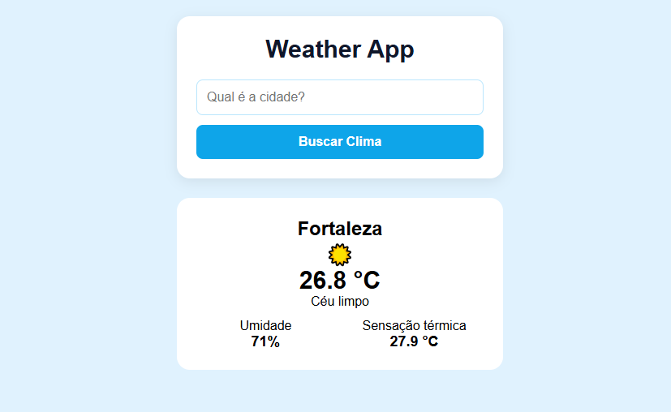

# 🌤️ Weather App

Aplicação web para consultar informações climáticas de diferentes cidades de forma simples e rápida.

O projeto foi desenvolvido com HTML, CSS e JavaScript e utiliza a API Open-Meteo para buscar a localização da cidade e obter os dados meteorológicos atuais.

## 📸 Preview

## 🚀 Funcionalidades

- Busca de clima por cidade
- Pesquisa pelo botão ou pressionando Enter
- Exibição da temperatura atual
- Exibição da sensação térmica
- Exibição da umidade
- Descrição da condição climática
- Ícones de acordo com a condição do clima
- Estado de carregamento durante a busca
- Validação de campos
- Tratamento de cidades não encontradas
- Tratamento de erros nas requisições
- Interface responsiva para dispositivos móveis

## 🛠️ Tecnologias

- HTML5
- CSS3
- JavaScript
- Open-Meteo API

## 🧠 Conceitos praticados

Durante o desenvolvimento deste projeto foram praticados conceitos como:

- Manipulação do DOM
- Eventos
- Funções
- Condicionais
- Operadores lógicos
- Template literals
- Consumo de APIs
- Fetch API
- Programação assíncrona
- `async/await`
- `try/catch/finally`
- Tratamento de erros
- Manipulação de objetos e arrays
- Responsividade com Media Queries

## 🌐 API

O projeto utiliza a Open-Meteo para:

1. Converter o nome da cidade em latitude e longitude.
2. Consultar os dados meteorológicos utilizando essas coordenadas.

## 🔗 Projeto online

O projeto também está disponível online:

https://ferreiramf.github.io/weather-app/

## 👨‍💻 Autor

Desenvolvido por Mateus Ferreira.
